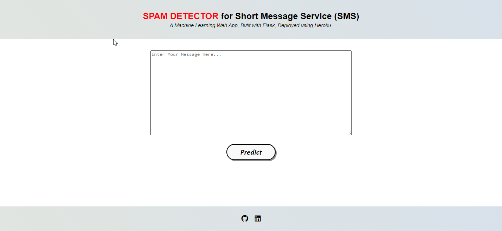

# SPAM-DETECTOR-for-SMS

### Objective:
The growth of the mobile phone users has led to a dramatic increase in SMS spam messages. Though in most parts of the world, mobile messaging channel is currently regarded as “clean” and trusted, on the contrast recent reports clearly indicate that the volume of mobile phone spam is dramatically increasing year by year. It is an evolving setback especially in the Middle East and Asia. SMS spam filtering is a comparatively recent errand to deal such a problem. It inherits many concerns and quick fixes from Email spam filtering. However it fronts its own certain issues and problems. This project inspires to work on the task of filtering mobile messages as Ham or Spam

### WEB APP URL: https://spamdetectorforsmsbyhrishikesh.herokuapp.com/
### Kaggle dataset: https://www.kaggle.com/uciml/sms-spam-collection-dataset

### During model building we have covered almost all data science concepts such as:
1. Import Libraries
2. Load Data
3. Data Preparation
4. Model Building.
5. Model Evaluation
6. Interpreting the ML Model
7. Making Predictions with the Model
8. Saving the Model (as .pkl file)
9. Deployment of the application.
10. Creating a Web application.
### Technology and tools this project covers:
1. Python as a programming language.
2. HTML, CSS & Flask for building Web pages.
3. Numpy and Pandas for data cleaning.
4. Matplotlib & seaborn for data visualization.
5. Natural Language Processing for model building.
6. pickle 
7. Flask 
8. Heroku (PaaS)
9. Jupyter notebook, Spyder as IDE.
* All the steps required to execute the project have been mentioned in the .ipynb file.
* ### WEB APP

### CREDITS
Special thanks to Mr.Anuj Vyas as he has created this amazing project initially using a kaggle problem statement and uploaded with a wonderful explanation on his Github.
